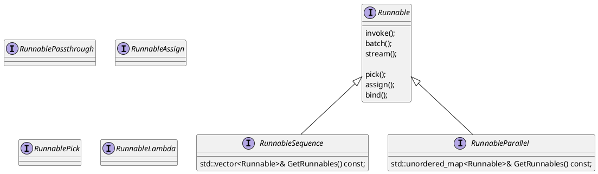

# instinct-chain

LLM magics for cpp world.

# Features

## Instinct Chaining

```plantuml
@startuml

concept GraphNodeType;

interface GraphNode<Input,Output> {
    Output Invoke(const Input& input);
    
    <RangeT extends List<Input>, RangeR extends List<Output>> 
    RangeR Batch(const RangeT& input);
    
    RangeR extends List<Output>
    RangeR Stream(const Input& input);
    
    Xn StateFunction() {
        
    }


}

interface FunctionNode<Input, Output> extends GraphNode<Input,Output> {
    
}

interface FunctionJoinNode extends GraphNode<State,State> {
    FunctionJoinNode& AddPort(const std::string& name, );

}


class BaseLLM implements GraphNode<std::string, BaseMessagePtr> {}

@enduml
```


```c++

auto chain = (prompt
    | model
    | output_parser  
);
chain.invoke("ice cream");

for(const auto& chunk in chain.stream("ice stream")) {
    std::cout << chunk << std::endl;
}

chain.batch(["ice stream", "noodles"])
```

```c++
auto vector_index = ic::retriver::FaissIndex;
auto retriver = ic::retriver::TopKRetriever{vector_index};

auto chain = (ic::core::RunnableMapping(
    {"context": retriver}, 
    {"question": ic::core::RunnablePassthrough()
    })
    | prompt
    | model
    | output_parser 
)


ic::core::RunnableState state = {};
chain.Invoke(state);
```

A -(s1)-> B -(s2  )-> C 
            -(s2' )-> D

```c++


class RunnableClousure {
    State state;
    Runnable* runnable;
    void opreator()() {
        return runnable->Invoke(state);
    }
}

class Runnable {
//    State state;
//        
//    void operator()() {
//        Invoke();
//    }
//    
    void Invoke(State&& state, const Executor& exectuor) {
    
    };
    
    
    SequenceRunnable operator|(Runnable&& another) {
        return SequenceRunnable(*this, std::forward<>(another));
    }
    
}


SequenceRunnable operator|(const Runnable& lhs, const Runnable& rhs) {
    SequnceRunnable
}

class SequenceRunnable {
    
    std::vector<Runnable*> fns;
    
   
    void Invoke(const State& state, const Executor& exectuor) {
        Taskflow tf;
        auto fn_view = fns | tf.emplace(RunnableClousure(fn, state)); 
        tf.linearize({fn_view.begin(), fn_view.end()});
        exectuor.run_once(tf);
    }
    
}


class State {
    void Put(K,V);
    V Get(K);
    void Begin();
    void Replace(State&& s);
    void Commit();
    State Snaptshot();
}

class MemoryJSONState {}


class RunnableMapping {
    std::map<std::string, RunnablePtr> runnables_;  

    void Invoke(State&& state, const Executor& exectuor) {
        Taskflow tf;
        State newState;
        auto finish = tf.emplace_back([&]()-> {
            state.Replace(newState);
            state.commit();
        });

        for(auto entry: runnables_) {
            auto t = tf.emplace_back(RunnableClousure(entry.second, state));
            t.name(entry.first);
            t.preced(finish);
        }
        exectuor.run_once(tf);
    }
    
}


```




# Roadmap

## v0.1 - Model I/O

* [x] PromptTemplate
* OllamaLLM
  * [x] generate/chat/embedding
  * [ ] stream

## v0.2 - Model I/O

* [ ] LCEL Composition: Pipeline & parallelism
* [ ] LLMs: OpenAI API, llama.cpp
* [ ] function calling support

## v0.3 - RAG

* [ ] faiss vectorstore
* [ ] document store
* [ ] Retriever classes
* [ ] official package release

## v1.0 - Build with InstinctAI.app


## v1.1 - Agents

TBD


# References


* API Endpoints
  * [ollama](https://github.com/jmorganca/ollama/blob/main/docs/api.md)
  * [OpenAI](https://platform.openai.com/docs/api-reference)
* 