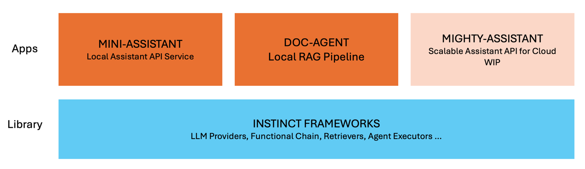

# ✨ instinct.cpp

`instinct.cpp` is a toolkit for developing LLM-powered applications.

       

**🚨 This project is under active development and has not reached to GA stage of first major release. See more at [Roadmap section](#roadmap).**

## Features

What `instinct.cpp` offer:

* Applications that are working out-of-box.
  * Assistant API server: Agent service that is fully compatible with OpenAI's Assistant API.
    * [mini-assistant-api](./modules/instinct-examples/mini-assistant): Single binary for single node deployment with vector database and other dependencies bundled. 
    * `mighty-assistant-api`: (**WIP**) A cloud native implementation that is highly scalable with distributed components and multi-tenant support.  
  * [chat-agent](./modules/instinct-examples/doc-agent): A CLI application that create knowledge index with your docs (PDF,TXT,MD,...) and launch an HTTP server that is fully compatible with OpenAI `ChatCompletion`.
* Frameworks to build LLM-based applications. Say it `langchain.cpp`.   
  * Integration for privacy-first LLM providers: Built-in support for [Ollama](https://ollama.com/) and other OpenAI compatible API services like [vllm](https://vllm.readthedocs.io/en/latest/), [llama.cpp server](https://github.com/ggerganov/llama.cpp/blob/master/examples/server/README.md), [nitro](https://nitro.jan.ai/) and more.
  * Building blocks for common application patterns like Chatbot, RAG, LLM Agent.
  * Functional chaining components for composable LLM pipelines.
  * Agent patterns: ReACT, Plan & Execute (**WIP**), LLMCompiler (**WIP**), ...

## User Guides

For built-in applications:

* [mini-assistant-api](./modules/instinct-examples/mini-assistant)
* [chat-agent](./modules/instinct-examples/doc-agent)

For library itself:

* [instinct.cpp library](./docs/library.md)

## Roadmap

Complete project plan is tracked at [Project kanban](https://github.com/users/RobinQu/projects/1/views/1?layout=board).

| Milestone                                                     | Features                                                                                             | DDL  |
|---------------------------------------------------------------|------------------------------------------------------------------------------------------------------|------|
| v0.1.0                                                        | Long-short memory, PDF/TXT/DOCX ingestor, `Chain` programing paradigm, RAG reference app `doc-agent` | 3.29 |
| [v0.1.1](https://github.com/RobinQu/instinct.cpp/milestone/1) | Performance tuning, RAG evaluation,  Function calling agent                                          | 4.16 |
| [v0.1.2](https://github.com/RobinQu/instinct.cpp/milestone/2) | OpenAI Assistant API initial implementation, single-binary reference app `mini-assistant`            | 4.30 |
| [v0.1.3](https://github.com/RobinQu/instinct.cpp/releases/tag/v0.1.3)                                                        | * `mini-assistant`:  tool calls with opensourced LLMs                                             | 5.17 |
| v0.1.4                                                        | * `doc-agent` : rerank model * `mini-assistant`: `file-search` tool support.                      | 5.31 |

Contributions are welcomed! You can join [discord server](https://discord.gg/2jnyqY9sbC), or contact me via [email](mailto:robinqu@gmail.com).
